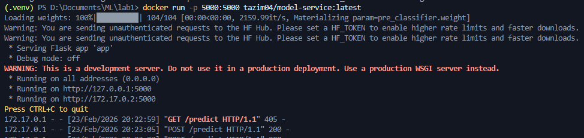
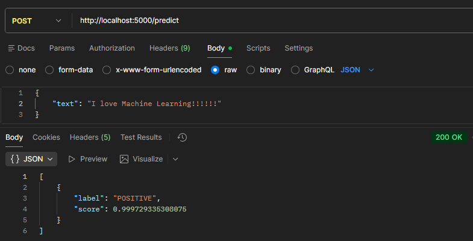
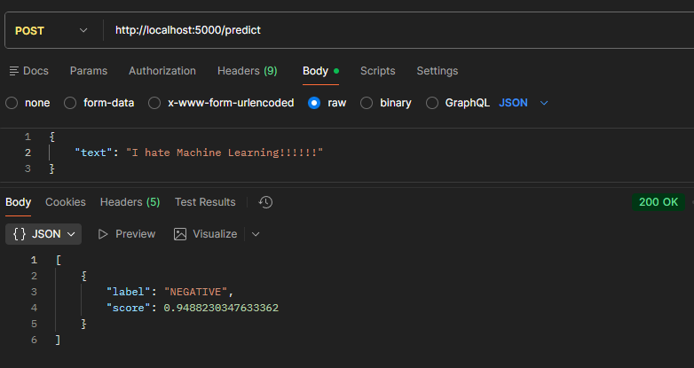
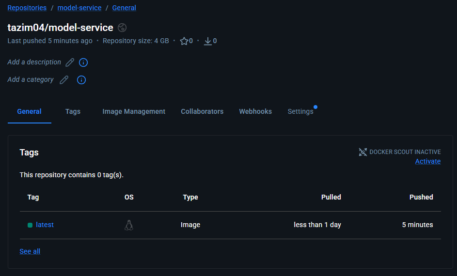

# SEG4180 Lab 1 - Dockerize and Serve a Pretrained Model

**Tazim Khan – 300282353**

**Pretrained Model Used:** https://huggingface.co/distilbert/distilbert-base-uncased-finetuned-sst-2-english

**Docker Hub Repository:** https://hub.docker.com/repository/docker/tazim04/model-service/general


## Running the Container locally:

Open the project root in the terminal and run:

### Option 1 - Build Locally

 ```bash
docker build -t tazim04/model-service:latest .
docker run -p 5000:5000 tazim04/model-service:latest
```

### Option 1 - Pull from Docker Hub

```bash
docker pull tazim04/model-service:latest
docker run -p 5000:5000 tazim04/model-service:latest
```
 
 The API will be available at `http://localhost:5000/predict`.

 ### How to test the API:

Send a `POST` request to: `http://localhost:5000/predict`. Include a JSON payload such as:

 ```json
 {
    "text": "I love Machine Learning!!!"
 }
 ```

 You can expect a response like:

 ```json
[
    {
        "label": "POSITIVE",
        "score": 0.999
    }
]
 ```

 You can use curl, Postman, or any REST client to test the endpoint.

## Screenshots

### Running Containerized Application


---

### Sample Request 1


### Sample Request 2


---

### Docker Hub Repository
